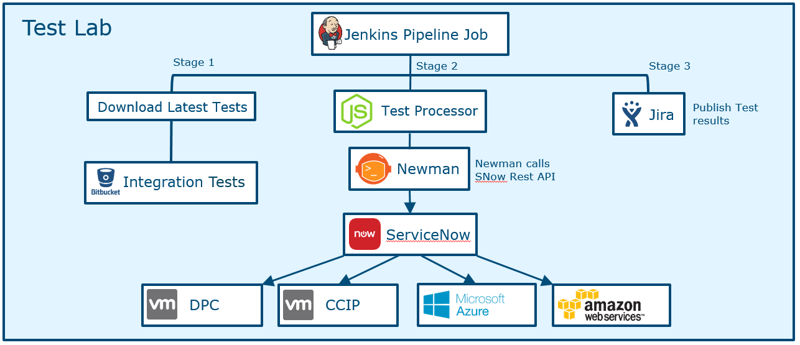
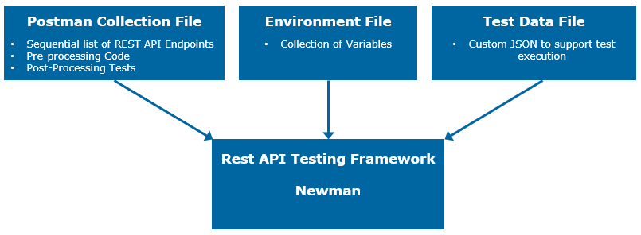

# MSF Rest API Testing

The MSF Rest API Testing Framework has been designed to test Rest APIs for Unit Testing and Integration Testing.  It works with test collections from [Postman](https://www.getpostman.com/) and executes them using [Newman](https://github.com/postmanlabs/newman). 

The Rest API Testing Framework is written in Node.JS and can be run on Linux or Windows platforms. 

An example use of the Test processor with the ServiceNow Rest API:



## Overview
The MSF Rest API Testing Framework requires a Postman Collection File, Environment File and Test files. 



### Postman Collection File
The Postman collection file describes the Rest API requests used for testing. These requests can be grouped into folders. Ideally a collection should be created so it's generic and reuseable. The Test files should include the test specific information that gets used by the collection file.  An example of this is making a request to the Azure Rest API. The test specific information is stored in the test file and the collection file is generic. It contains a createjob request. The next request in the collection will query the status every 10 seconds until there is a pass or failure. Finally it will read the job result data for the test. 
### Environment File 
The Environment File contains any variables you want to reuse in the tests.  This could be the server address and username and password. 
### Test files
The Test files are JSON files that contain information about the tests. Tests can be added to groups that can be run sequential or in parallel.  The test files also contain the paths to the collection and environment files. More detailed information about test files is provided below. 

---

## Requirements 
- [Node.js](https://nodejs.org/en/) => v8.9.1

## Dependencies
 #### Node.js packages
 - [newman](https://www.npmjs.com/package/junit-report-merger)
 - [promise-each](https://www.npmjs.com/package/promise-each)
 - [recursive-readdir](https://www.npmjs.com/package/readdir-recursive)
 - [junit-report-merger](https://www.npmjs.com/package/junit-report-merger)
 - [dateformat](https://www.npmjs.com/package/dateformat)
 - [minimist](https://www.npmjs.com/package/minimist)
 - [winston](https://www.npmjs.com/package/winston)
 - [winston-daily-rotate-file](https://www.npmjs.com/package/winston-daily-rotate-file)
 - [xunit-viewer/cli](https://www.npmjs.com/package/xunit-viewer)
 - [newman-reporter-junitextended](reporters/newman-reporter-junitextended/README.md)
 

## [Installation](./docs/installation.md)

## [Configuration](./docs/configuration.md)

## [Running the Rest API Testing Framework](./docs/running-framework.md)


## [Creating a Postman Collection File](./docs/postman-collection-file.md)

## [Test Data Files](./docs/test-files.md)
<!-- 
## Storing Values for future tests -->

### Release History

| Version       | Date          | Notes |
| ------------- |:-------------:| ------|
| 1.4.0         | 23/February/2017   | Added option to set Postman collection timeout. Allows longer processing time for longer tests. Fix for updating Stored Values. Updated gitignore |
| 1.3.1         | 07/December/2017   | JSON parse added to additionalTestParameters. |
| 1.3.0         | 29/November/2017   | Updated documentation to provide more information. Collections and JSON Test Files can use stored values. |
| 1.2.0         | 09/November/2017   | Added Newman Reporter to enable detailed failure information in Junit Reports. The testName from the JSON test file is now used as the Jira Test Issue Summary value. Postman collections now support the request name in a ```Test.*****``` format. |
| 1.1.1         | 04/October/2017   | Fix for 'HTMLResultsReport_Create' error. Updated Readme.md with mandatory requirement for environmentData and collectionFile parameters in test file. |
| 1.1.0         | 19/September/2017   | Added optional support for proxy servers. Updated readme and added proxy-setup with information about setting up Cntlm Authentication Proxy. HTML report creator added. |
| 1.0.4         | 29/August/2017   | Added error handling for none existant collection data file or environment data file |
| 1.0.3         | 29/August/2017   | Removed extra console.log |
| 1.0.2         | 25/August/2017   | Enhancements to Rest API Framework. Process multiple test files in a single run. ```junitReportMergered.xml``` is also saved to the ```/test_runs/latest``` directory. Additional test parameter added called ```testParameters```. A few other fixes|
| 1.0.1         | 21/July/2017   | Documentation updated |
| 1.0.0         | 07/June/2017   | First release. |