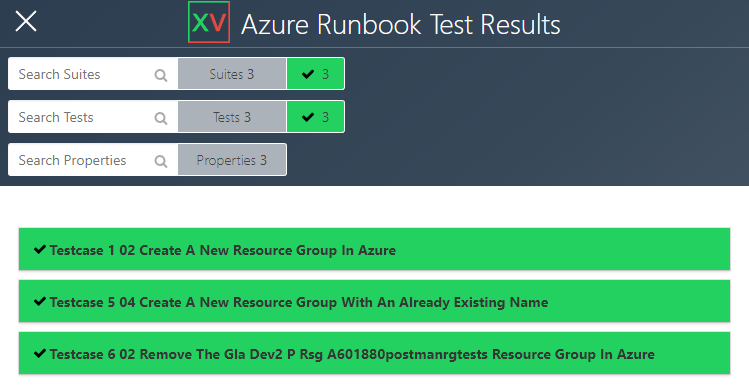

#  Rest API Testing Framework Configuration
The Rest API Testing Framework comes with a example configuration file called ```config.json.example``` in the project root. To use the configuration file rename this to ```config.json```.

## Add Proxy configuration
If you are running the Rest API Testing Framework behind a proxy server you need to update the proxy config for the proxy servers you are using e.g. 

```
{
    "HTTP_PROXY":"http://127.0.0.1:3128",
    "HTTPS_PROXY":"http://127.0.0.1:3128"
}
```

## Optional: create a html test report output
You can enable creation of a html test report by adding ```"HTMLResultsReport_Create" : true,``` and ```HTMLResultsReport_Title``` to the ```config.json``` file.  

```
{
    "HTMLResultsReport_Create" : true,
    "HTMLResultsReport_Title" : "Test Results"
}
```


## Optional: set Postman collection timeout
The timeout for a processing of a Postman collection can be increased by providing the number of minutes for the ```collectionTimeout``` value in the ```config.json``` file. The default value used it 5 minutes. 

```
{
    "collectionTimeout" : 15
}
```
