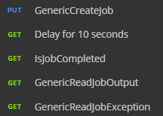
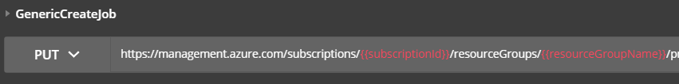
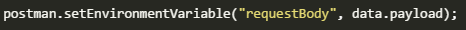
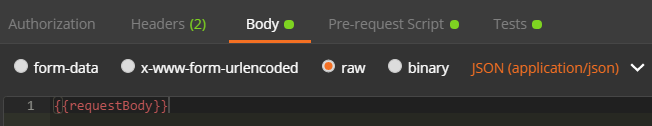
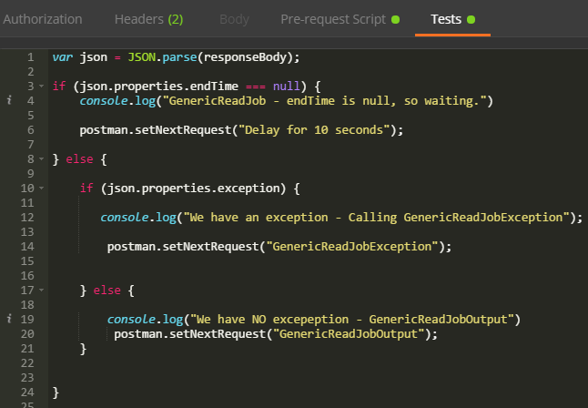
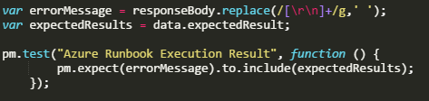
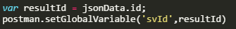

# Creating a Postman Collection File

The Postman collection file describes the Rest API requests used for testing. 

For help with using Postman please refer to the online [Postman documentation](https://www.getpostman.com/docs/).   

--- 
## Creating a generic collection
It's best to create reusable requests which can be grouped into postman collection folders. The example below shows a collection of requests for Azure unit testing. 



### Creating a generic request
The first request is a generic request to execute a Azure Runbook.  To make the request generic it uses information from the JSON Test Data file and environment file. 

Below you can see the url of the request. The ```{{subscriptionId}}``` and ```{{resourceGroupName}}``` values will come from the Postman environment file. They can also be provided from the **Pre-request Script** so could be values from the JSON Test Data file. 



The example below shows setting a environment variable in the generic Azure Runbook request within the Postman **Pre-request Script**.  The data object is the data from the JSON Test Data file for this test. In this example the value of payload is set to the environment variable ```requestBody```



The screenshot below shows the body for this generic job. The data that will be submitted comes from the environment variable ```requestBody```.  



### Checking request status and looping

The status of a request needs to be checked in this example collection.  From the image above that shows the collection of requests you can see the second step is a delay. This is a simple GET request to the url ```https://postman-echo.com/delay/10```  After 10 seconds Postman/Newman will process the next request. 

In this example collection the request ```IsJobCompleted``` checks the status of the request.  This check is done within the Postman Tests script. Below you can see a check if the endTime value is null. If null the ```Delay for 10 seconds``` is called again. If there is a endTime value there is a check to determine if there was an exception. 

The use of ```postman.setNextRequest``` allows you to control how the collection of requests if navigated. 



### Running a test against the result
Finally the collection checks the job result and runs a test against it.  In the example below ```pm.expect``` is used to carry out the test. This uses the [ChaiJS expect BDD library.](http://chaijs.com/api/bdd/)  



---
## Data from the JSON Test Data file 
The table below shows you the test fields from the JSON Test Data file and the matching data object field

| Test file field       | Data Object field in Postman  | 
| --------------------- |-------------------------------| 
| testName              | data.name                     |
| testDescription       | data.description              |
| testExpectedResult    | data.expectedResult           |
| testParameters        | data.testParameters           |
| testURL               | data.url                      |
| testBody              | data.payload                  |

---
## Examples of using data from the JSON Test Data file
Below are examples of how you can use the data from the JSON Test Data file within the Postman  **Pre-request Script**. Each example takes the data and stores it in a Postman Environment Variable. 

### Using URL field from the JSON Test Data file 

``` 
postman.setEnvironmentVariable("URL", data.url);
```
### Using testBody field from the JSON Test Data file 

```
postman.setEnvironmentVariable("requestBody", data.payload);
```
### Using testParameters field from the JSON Test Data file 

```
postman.setEnvironmentVariable("JobTemplateName", data.testParameters.JobTemplateName);
```

---
## Storing values for use in future tests
It's possible to store values from Postman requests for use in future tests.  These values are only available during the same Rest API Test Framework run/execution.  

One possible use of this is to get a authentication token and then store it for future requests in the test run. 

The example below shows a script within the Postman **tests** script.  It takes the result and stores this to the variable ```resultId```. This is then stored in a Postman global variable ```svId```.  All values that you want to store for reuse **must** key starting with ```sv``` If this is missing the value will be ignored. 



To see examples of how to use the stored values in tests files please refer to the [Test Files](test-files.md) document. 

----
## The power of Postman
This document scratches the surface of the power Postman and the Rest API Testing Framework can provide. To find out more about the power of Postman please refer to the [Postman documentation here](https://www.getpostman.com/docs/) and the [Postman Sandbox API reference](https://www.getpostman.com/docs/postman/scripts/postman_sandbox_api_reference).  The [Postman Sandbox API reference](https://www.getpostman.com/docs/postman/scripts/postman_sandbox_api_reference).document has information about available libraries and NodeJS modules.
