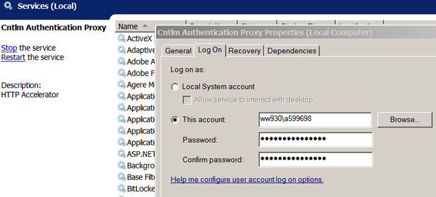
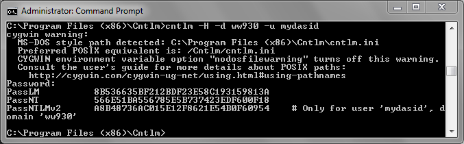

# Install and Configure local NTLM proxy

The Atos web proxies only support the Microsoft proprietary NTLM authentication method therefore any outbound connection will need to either use this or be “wrapped” by another program that supports this. An ideal candidate for this wrapping is [Cntlm Authentication Proxy](http://sourceforge.net/projects/cntlm/)

## Cntlm Installation

The cntlm program is installed on the local system (e.g. Atos corporate laptop with Windows 7). [Download](http://sourceforge.net/projects/cntlm/) the latest release of [cntlm](http://sourceforge.net/projects/cntlm/) and accept the defaults for the installatin. 

## Configuration

### Configure cntlm service  
Configure cntlm to run as a service logging on with the your account (rather than local system account) in the ```Services``` configuration panel. ```Services``` is located under ```Administrative Tools```  Once configured the cntlm service should look like this in ```Services```:


### Configure cntlm.ini
Once cntlm Authentication Proxy is installed the next step is to configure cntlm, specifically including how to use the Atos proxies with your credentials. The configuration file is plain text and is named “C:\Program Files (x86)\Cntlm\cntlm.ini”. Edit this file using a text editor of choice running as administrator. 

The entries for ```Username``` and ```Domain``` are to be set to the DAS ID and ```ww930``` respectively. The user’s password should not be added here in plain text but a hash of the password used instead. This will be covered in detail below. 

The entries for “Proxy” in the configuration file should contain the names (or IP addresses) of the proxies in preferred order, e.g.:

```
Proxy           10.86.35.73:84
Proxy           10.96.0.80:84
Proxy           157.203.2.90:84
Proxy           10.89.0.72:84
```
The above order are - de, us, uk, fr

The Atos proxies listen on port 84 so the “:84” is added as a suffix to the name or IP.

By default the cntlm proxy will listen on localhost address (127.0.0.1) port 3128. 

### Create and add NTML hash

To create the NTML hash the program cntlm.exe is run from the command line with option “-H”. Open Command Prompt with run as administrator selected. From the cntlm installation folder run this command with your DAS ID. 

```
cntlm –H -d ww930 -u <dasid>
```



The resulting hash displayed needs to be copied and pasted in for the entry “PassNTLMv2” so the entry looks like below example:

```
Username	a599698
Domain		ww930
PassNTLMv2	A8B48736AC015E12F8621E54B0F60954
```

### Startng cntlm 
Once the configuration has been completed and checked the cntlm service can be started. This can be done from the start menu using ```Start Cntlm Authentication Proxy``` or the ```services``` configuration.  